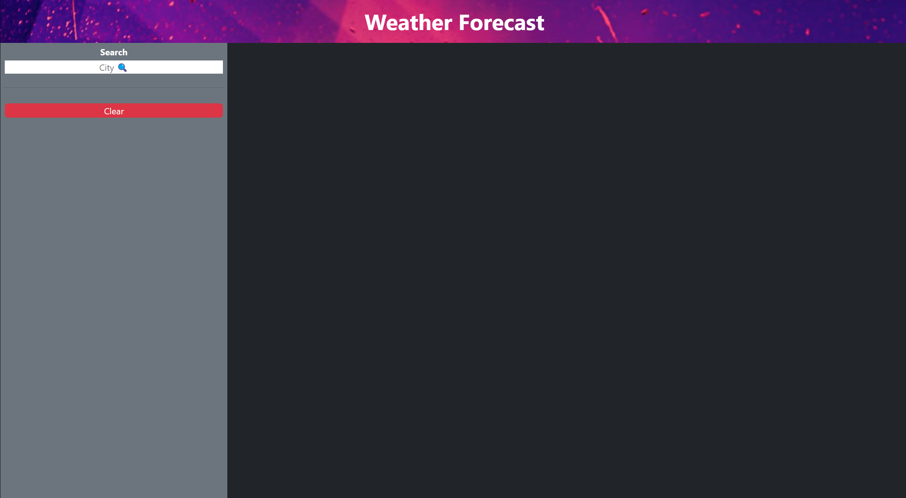
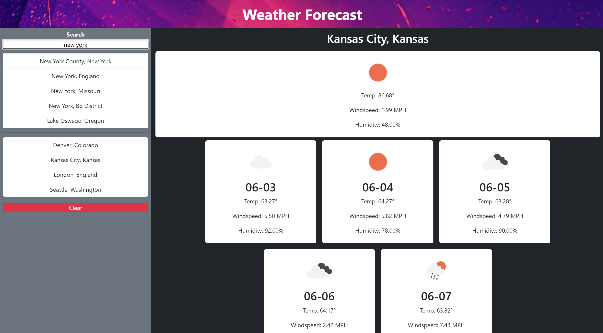

# weather-forecast

## Description
This is a simple weather web app that allows you to see the current and future weather for a certain city

## Usage
The user types the name of a city in the search bar and clicks on one of the results to add that city to a list of saved cities. Then the user can click on one of the saved cities to display the weather information. Saved cities are saved into localStorage making them persistent through page refreshes. There is a clear button that removes the weather data and saved cities from the page.

## Screenshots
This is how the page looks upon first loading

This is how the page looks during use. You can see the search functionality, saved cities, and weather data.

## API Usage
The website uses openweathermap's API to get its weather data. It also uses their geocoding API to get search results for the cities and translate them into GPS coordinates.
Their API returns very detailed results and it allows me to convert the units into imperial, metric, etc. It also gives me the icons for the weather condition.